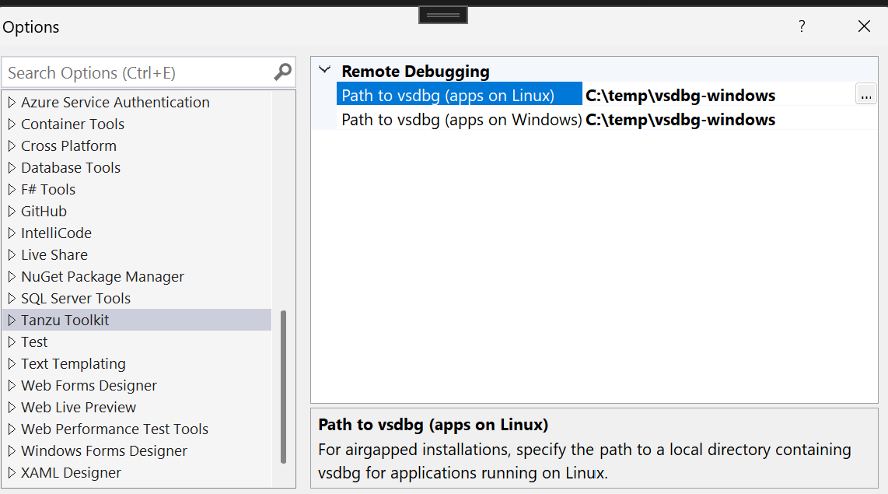

# Tanzu Toolkit for Visual Studio

Tanzu Toolkit for Visual Studio is an extension for Visual Studio 2022 that allows users of Tanzu Platform (formerly known as Tanzu Application Service or TAS) to manage apps directly from within the IDE. Users of this extension are able to:

- Manage Tanzu Platform environments with the [Tanzu Platform Explorer](https://github.com/vmware-tanzu/tanzu-toolkit-for-visual-studio/wiki/Tanzu-Application-Service-Explorer)
  - View orgs, spaces, and apps
  - Start / stop / delete apps
  - Tail app logs
- Deploy apps from Visual Studio using the [App Deployment window](https://github.com/vmware-tanzu/tanzu-toolkit-for-visual-studio/wiki/App-Deployment-Window)
  - Use / create Cloud Foundry manifest files for consistent app deployments
- [Remotely debug](https://github.com/vmware-tanzu/tanzu-toolkit-for-visual-studio/wiki/Remote-Debugging-TAS-Apps) apps running on Tanzu Platform within Visual Studio

## Install

To install this extension, you will need Visual Studio version 2022. This extension can be downloaded within the IDE by searching "Tanzu" in the "Manage Extensions" window.

This extension can also be installed outside of Visual Studio by first downloading the appropriate `.vsix` file, then double-clicking it to prompt an installation.

The `Tanzu.Toolkit.VisualStudio.vsix` extension file is included in each [release](https://github.com/vmware-tanzu/tanzu-toolkit-for-visual-studio/releases) in this repository.

Alternatively, latest builds can be found on vsixgallery.com, though these may contain features still under development:

 [VS 2022](https://www.vsixgallery.com/extension/TanzuToolkitForVisualStudio2022.ff7b6f3e-0410-4ff9-a40a-a719ee9da901)

## Uninstall

This extension can be uninstalled from Visual Studio using  "Manage Extensions" window.

## Airgapped installations

### Remote Debugging

Remote debugging in air-gapped environments requires you to supply your own OS-specific copy of vsdbg, which the extension can bundle with the app during deployment.
The path to vsdbg must be specified in the Tanzu Toolkit section of the Visual Studio options on your machine:

On a machine that does have internet access, you may use the script [download-vsdbg.ps1](./download-vsdbg.ps1) to acquire the current version of vsdbg for apps running on Linux and Windows.

## More Info

Check out our [Wiki](https://github.com/vmware-tanzu/tanzu-toolkit-for-visual-studio/wiki)! It goes into more detail on several features.

## Demo videos

### Overview

<https://user-images.githubusercontent.com/22666145/153500532-c1c5b322-3a9c-40ad-8d7f-a479fa8a5f36.mp4>

### App Deployment using a Manifest

<https://user-images.githubusercontent.com/22666145/144128093-8d1686c3-eac1-4bf1-baaa-8eb7c262f5d0.mp4>

### Deploying 'Published' .NET apps

<https://user-images.githubusercontent.com/22666145/168921943-52da9ddd-4697-4f30-8181-8d6f9db01d52.mp4>

### Remote Debugging .NET apps running on Tanzu Platform

<https://user-images.githubusercontent.com/22666145/168921959-31d21d43-93bb-4b73-80d8-05a1256bb62f.mp4>
